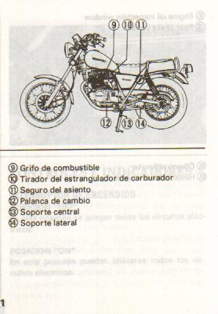

# GN250 Owners Manual Translation
Quick project to translate the Suzuki GN250 owner's manual from Spanish to English.
(because I could only find the manual online in Spanish)



Steps:
 1) perform OCR to extract Spanish text from manual
 2) translate Spanish text to English
 3) interleave original manual pages with pages of English translation

Note, translate-shell can randomly fail to produce output, if google API stops returning results (rate limiting?)
In this case, this script will exit with an error message, but you can run it again a little later and it will
pick up where it exited (intermediate files are saved)

## Result
The resulting manual with english translation is available [here](gn250_manual_with_translation.pdf)

## Next Steps
* Translation accuracy is limited - investigate OCR and translation steps for source of errors
* Generalise - would be nice to have a general purpose tool for translating any document
* Font size - increase font size on translation pages

## Dependencies:
```text
tesseract-ocr
https://github.com/soimort/translate-shell (using 0.9.6.11-git:598b6c7 installed from github)
pandoc
texlive-latex-base
texlive-fonts-recommended
texlive-extra-utils
```