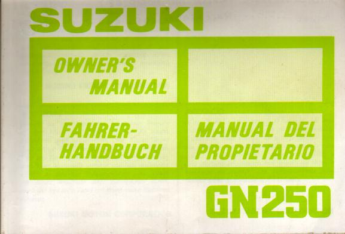

# GN250 Owners Manual Translation
Quick project to translate the Suzuki GN250 owner's manual from Spanish to Engligh.
(because I could only find the manual online in Spanish)



Steps:
 1) perform OCR to extract Spanish text from manual
 2) translate Spanish text to English
 3) interleave original manual pages with pages of English translation

Note, translate-shell can randomly fail to produce output, if google API stops returning results (rate limiting?)
In this case, this script will exit with an error message, but you can run it again a little later and it will
pick up where it exited (intermediate files are saved)

## Dependencies:
```text
tesseract-ocr
https://github.com/soimort/translate-shell (using 0.9.6.11-git:598b6c7 installed from github)
pandoc
texlive-latex-base
texlive-fonts-recommended
```